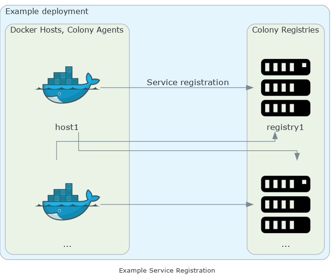
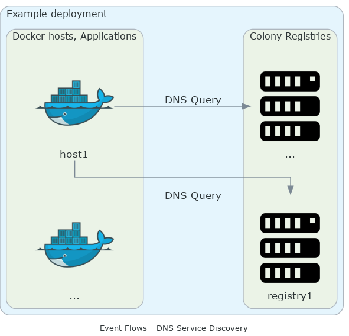
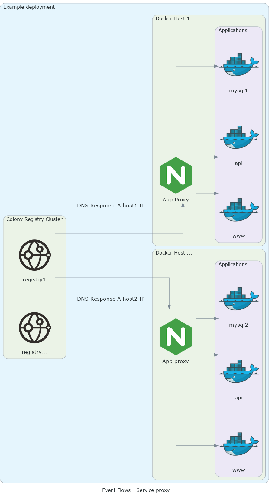

# Topology

The following diagrams illustrate the basic principles of Colony.

## Service registration / unregistration

Colony Agents running on each Docker host are forwarding container names
to registry servers. When containers get shut down, they also get
unregistered from the configured registries.

## Resolving services

As applications query the DNS server, it responds with the host IP which
is running an application instance. The application connects to the host
directly, while a service mesh would proxy the request.

## Connecting to services

By using either `nginx-proxy` or `caddy-gen` or some other strategy to
route requests from an ingress point on the host to the individual
containers, we can connect and query individual services on the host.

These proxies work in a similar way to Colony, in that any start or stop
of the docker containers will update the proxy configuration, so requests
can be routed to your services.